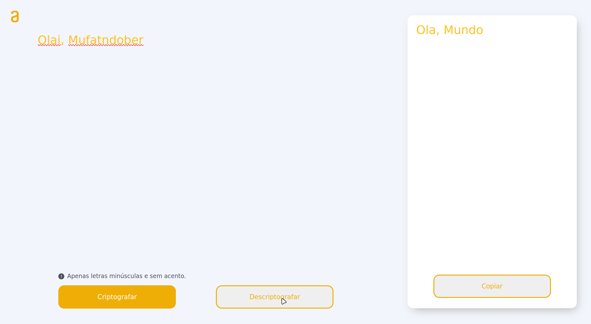

# Decodificador de Texto


Com uma interface minimalista, é possível criptografar e descriptografar um texto completamente, desde que não possua letras maiúsculas e acento.

## Como funciona o decodificador

- Passo 1

  ```javascript
  // Chave do objeto é a letra que será substituída pelo valor do objeto

  const cryptography = { e: "enter", i: "imes", a: "ai", o: "ober", u: "ufat" }
  ```

- Passo 2

  ```javascript
  // Para criptografar a função decoderString recebe um texto e um objeto

  export function decoderString(text, obj) {
    let modifiedText = text
    Object.keys(obj).forEach((key) => {
      modifiedText = modifiedText.replace(new RegExp(key, "g"), obj[key])
    })
    return modifiedText
  }
  ```

- Passo 3

  ```javascript
  // A função invertKeysAndValues substitui as chaves pelos valores do objeto.

  export function invertKeysAndValues(obj) {
    const invertedObj = {}
    Object.keys(obj).forEach((key) => {
      const value = obj[key]
      invertedObj[value] = key
    })
    return invertedObj
  }
  ```

- Passo 4

  ```javascript
  // Para descriptografar, usa-se o passo 3 para inverter chave-valor do objeto, assim, repetindo o mesmo que o passo 2, a mesma função poderá descriptografar o texto

  const cryptography = { ... } // Passo 1
  const encryptedText = decoderString('text', cryptography) // Passo 2

  const newCryptography = invertKeysAndValues(cryptography) // Passo 3

  const decryptedText = decoderString(encryptedText, newCryptography) // Passo 4
  ```

## Criptografar

Digite sua mensagem no campo e após isso confirme no botão `criptografar`. A mensagem criptografada aparecerá no campo ao lado. Clicando no botão `copiar`, a mensagem irá para a sua área de transferência (o mesmo que o atalho de teclado `ctrl + c`).

## Descriptografar

 Digite sua mensagem criptografada no campo e após isso confirme no botão `descriptografar`. A mensagem descriptografada aparecerá no campo ao lado. Clicando no botão `copiar`, a mensagem irá para a sua área de transferência (o mesmo que o atalho de teclado `ctrl + c`).
